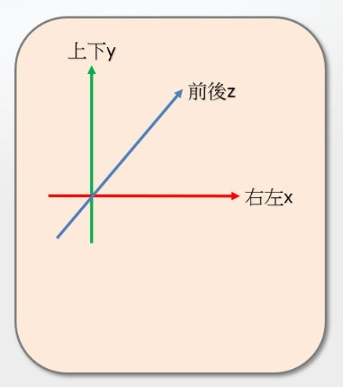
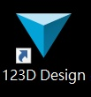
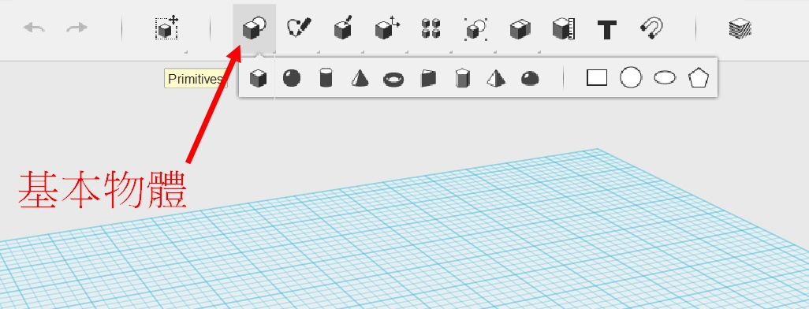
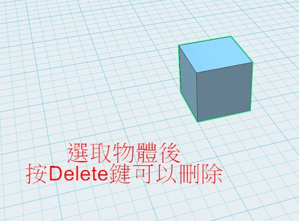
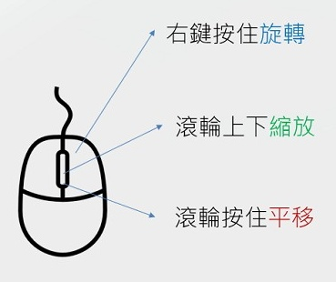
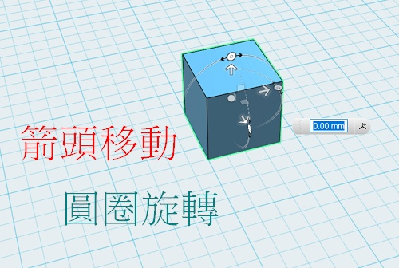
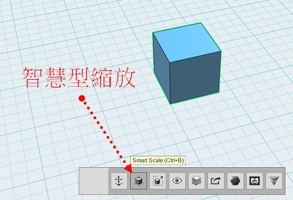

---
hide:
  - navigation
---

# ❤️ 3D - 123D Design 基本操作

### 🔹 3D的應用

----------------------------

: 3D的應用有哪些？從3D圖形設計者的角度來瞭解：

: <iframe width="560" height="315" src="https://www.youtube.com/embed/VT5oZndzj68?start=25&amp;end=118" frameborder="0" allow="accelerometer; autoplay; encrypted-media; gyroscope; picture-in-picture" allowfullscreen></iframe>

: (1分33秒, 選中文字幕,  資料來源:[^intro_3d_graphics])

[^intro_3d_graphics]:學習3D電腦圖像的新手指南, By 
Blender Guru, [youtube連結](https://youtu.be/VT5oZndzj68) 

  

-------------------------------

### 🔸 立體空間

----------------------------

: 3D也可稱為3維空間，是由右左、上下、前後3個維度(3 Dimensions)所構成的空間。

: 

: 還記得在Scratch中，角色的定位，可以使用右左x，上下y的座標來標示位置。那在立體的空間中要如何標示位置呢？

  

-------------------------------

### 🔹 軟體開啟與基本物體

----------------------------

: 點擊桌面的圖示(如下圖)，開啟123D design

: 

 

: 試著新增一個基本物體

: 

 

: 如何刪除物體？

: 

  

-------------------------------

### 🔸 攝影機操作 

----------------------------

: 123D Design內建了座標與攝影機(視角)的輔助操作，幫助我們了解與設計3D模型。 

: 

: 試著操作攝影機，以不同的方式觀察物體

 

: 右上角的「房子」可以回到預設視角(重設攝影機)，點擊「方塊」的面與邊也可以控制視角。

: 

  

-------------------------------

### 🔹 物體移動與旋轉 

----------------------------

: 選取物體後，點擊「move」

: 

  

: 以3個方向來控制物體的移動以旋轉，雖然比較複雜，但是精準

: 

  

-------------------------------

### 🔸 智慧型縮放 

----------------------------

: 選取物體後，點擊「smart scale」

: 

  

: 用滑鼠調整物體大小 (也可以點擊尺寸數字後，改變大小)

: 

  
