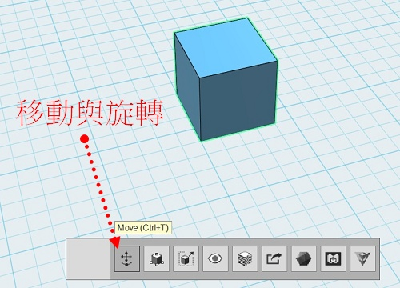
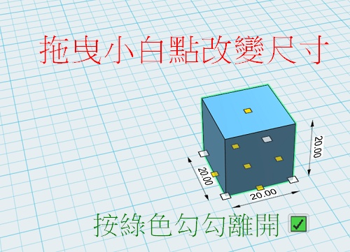
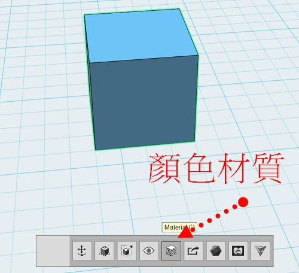
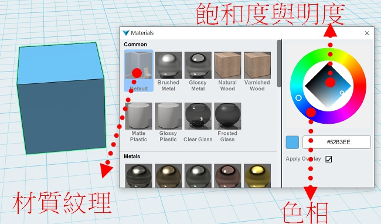
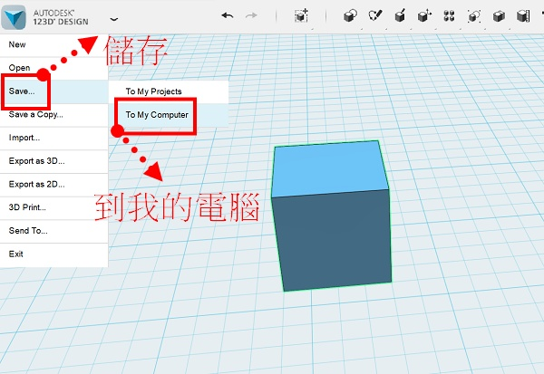

---
hide:
  - navigation
---

# ❤️ 3D - 123D Design 基本操作

??? info "軟體下載(windows版)"

    : :fontawesome-solid-link: <a href="https://inplus.tw/archives/10629" target="_blank">輕巧好上手的123D Design最終版下載</a>

??? info "參考影片 - 造型設計教學"

    : :fontawesome-solid-link: <a href="https://www.youtube.com/watch?v=CeyTDpxB0sQ" target="_blank">123D Design手裡劍造型</a>

    : :fontawesome-solid-link: <a href="https://www.youtube.com/watch?v=PJ3mCBwNHlM" target="_blank">123D Design船</a>

    : :fontawesome-solid-link: <a href="https://www.youtube.com/watch?v=WzYIGt7AdR0" target="_blank">123D Design形狀玩具</a>

    : 也可自行到youtube搜尋

??? example "操作熱鍵"

    : :fontawesome-solid-link: <a href="https://inplus.tw/archives/847" target="_blank">123D DesignHot Key熱鍵列表</a>

### 🔹 3D的應用

----------------------------

: 3D的應用有哪些？從3D圖形設計者的角度來瞭解：

: <iframe width="560" height="315" src="https://www.youtube.com/embed/VT5oZndzj68?start=25&amp;end=118" frameborder="0" allow="accelerometer; autoplay; encrypted-media; gyroscope; picture-in-picture" allowfullscreen></iframe>

: (1分33秒, 選中文字幕,  資料來源:[^intro_3d_graphics])

[^intro_3d_graphics]:學習3D電腦圖像的新手指南, By 
Blender Guru, [youtube連結](https://youtu.be/VT5oZndzj68) 

  

-------------------------------

### 🔸 立體空間

----------------------------

: 3D也可稱為3維空間，是由右左、上下、前後3個維度(3 Dimensions)所構成的空間。

: 

: 還記得在Scratch中，角色的定位，可以使用右左x，上下y的座標來標示位置。那在立體的空間中要如何標示位置呢？

  

-------------------------------

### 🔹 軟體開啟與基本物體

----------------------------

: 點擊桌面的圖示(如下圖)，開啟123D design

: 

 

: 試著新增一個基本物體

: 

 

: 如何刪除物體？

: 

  

-------------------------------

### 🔸 攝影機操作 

----------------------------

: 123D Design內建了座標與攝影機(視角)的輔助操作，幫助我們了解與設計3D模型。 

: 

: 試著操作攝影機，以不同的方式觀察物體

 

: 右上角的「房子」可以回到預設視角(重設攝影機)，點擊「方塊」的面與邊也可以控制視角。

: 

  

-------------------------------

### 🔹 物體移動與旋轉 

----------------------------

: 選取物體後，點擊「move」

: 

  

: 以3個方向來控制物體的移動以旋轉，雖然比較複雜，但是精準

: 

  

-------------------------------

### 🔸 智慧型縮放 

----------------------------

: 選取物體後，點擊「smart scale」

: 

  

: 用滑鼠調整物體大小 (也可以點擊尺寸數字後，改變大小)

: 

  

-------------------------------

### 🔹 物件顏色與材質 

----------------------------

電腦的顯示器，將不同強度的紅、綠、藍色光混合來生成不同的顏色，這就是RGB三原色的加色法，但這種顏色對大多數人來說並不直覺，比如我們很難直接判斷出橘色的RGB比例。

HSV是另一種色彩的模型，它代表的是色相、飽和度與明度。以人類更熟悉的方式來表達顏色：「這是什麼顏色？深淺如何？明暗如何？」。

: 

: (資料來源:[^hsv_color])

[^hsv_color]: HSL和HSV色彩空間, [維基百科連結](https://zh.wikipedia.org/zh-tw/HSL%E5%92%8CHSV%E8%89%B2%E5%BD%A9%E7%A9%BA%E9%97%B4)

  

: 在123D Design中，可以改變物件的顏色及材質

: 點選物體後，選「material」

: 

  

: 下圖中，右方色環可調整顏色，左方可改變材質紋理

: 

    

-------------------------------

### 🔸 儲存檔案 

----------------------------

: 設計的作品，要儲存檔案，才能長久保存

: 從左上角選單，找到「Save」，點選「To My Computer」

: 

   