---
hide:
  - navigation
---

# ❤️ 3D - 造型模具

-------------------------------

### 🔹 認識造型模具

----------------------------

: 各位同學，你知道餅干是怎麼做出來的嗎？

<iframe width="560" height="315" src="https://www.youtube.com/embed/tDttOIYnTBg?start=0&amp;end=101" frameborder="0" allow="accelerometer; autoplay; encrypted-media; gyroscope; picture-in-picture" allowfullscreen></iframe>

: ( 資料來源:[^cookie_maker])

[^cookie_maker]: 【宏祥旅行社 x 郭元益糕餅博物館】「焙」同。回憶 - 海底生物造型餅乾DIY！by 
宏祥旅行社 Edison Tours, youtube網址:https://youtu.be/tDttOIYnTBg .

: 麵粉、粉、奶油、雞蛋等材料做出麵糊， 麵糊放入烤箱就可以做出餅干。在過程中，如果有個可愛的造型模具，就可以讓餅干有各種不同的造型。

: 造型模具可以有不同的材料與製作方式，在這個單元中，我們會使用3D列印設計來製作。

 
 

-------------------------------

### 🔹 草圖、接線與抽殼

----------------------------

: 要畫出模具的輪廓造型，需要能夠畫出各種線條。接下來一起來練習各種草圖的用法。
: 「**橢圓形**」的草圖，可以畫出如卡通臉形或是耳朵的輪廓。利用兩個不同長短的半徑可以畫出橢圓形。
: 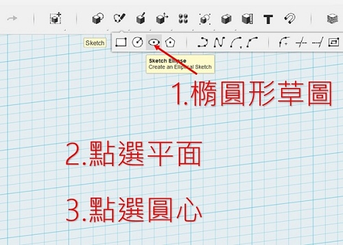
: 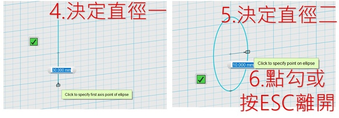

 
 

: 「**多邊形**」的草圖可以調整邊數，如正6邊形或正5邊形。
: 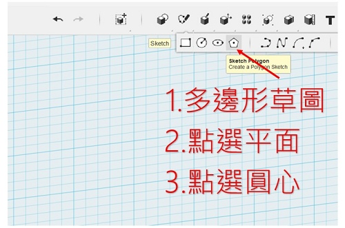
: 

 
 

: 「**折線**」的草圖可以畫出任意的多邊形，拖曳時也可以拉出圓弧。
: 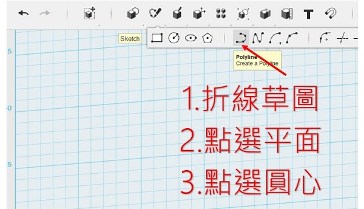
: 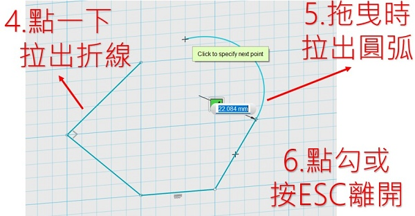

 
 

: 要注意線條必需要**封閉**(圍成一圈)，有封閉才可以擠出成形。
: 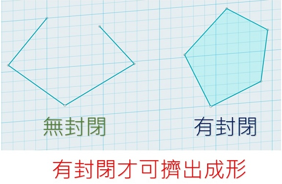

 
 

: 「**曲線**」的線條可以設計出不同弧度的的線條。
: 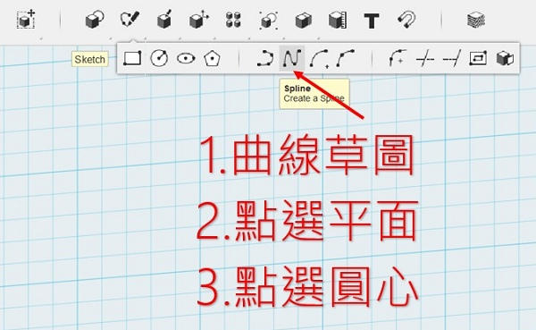
: 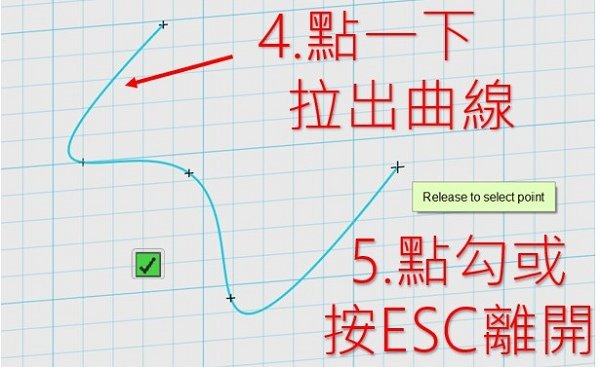
 
 
 

: 如果想要將各種不同的草圖組合或分割，一定要做「**接線**」的動作。接線時，要先點選前一個草圖。
: 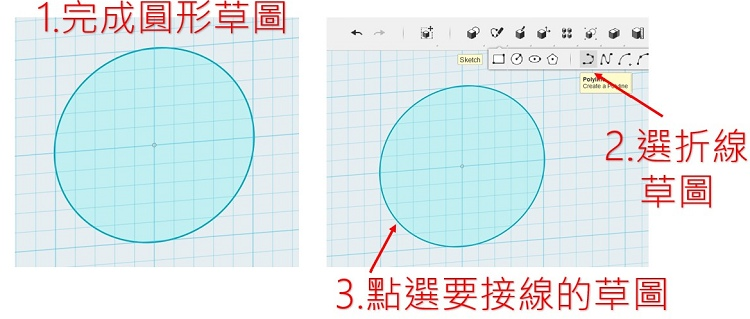
: 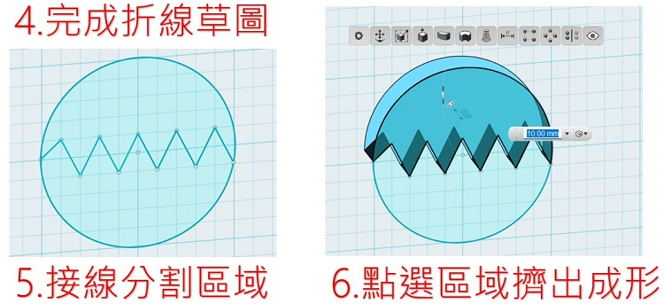
 
 

: 如果有多餘的線條要刪除，可以使用「**擦拭**」功能。
: 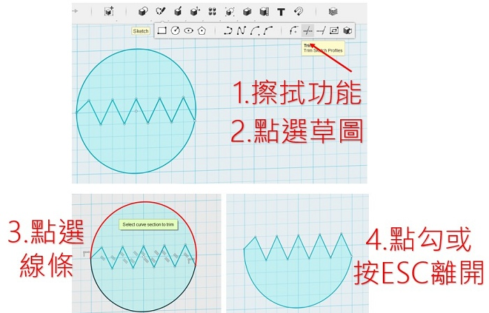

 
 

: 將設計好的立體形狀，做「**抽殼**」動作，可中間抽空。
: 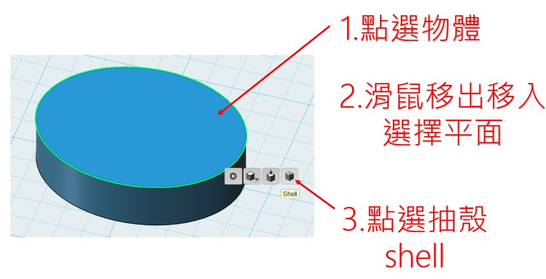
: 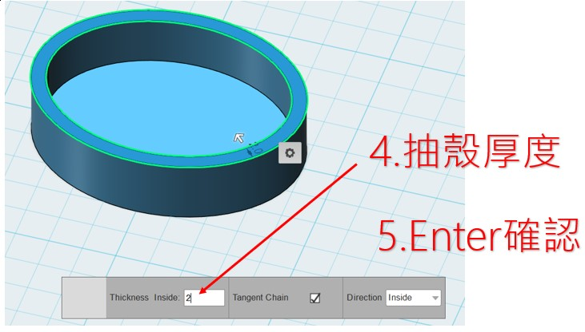

 
 
 

: 最後，利用「**壓平**」功能，把底面去除。
: 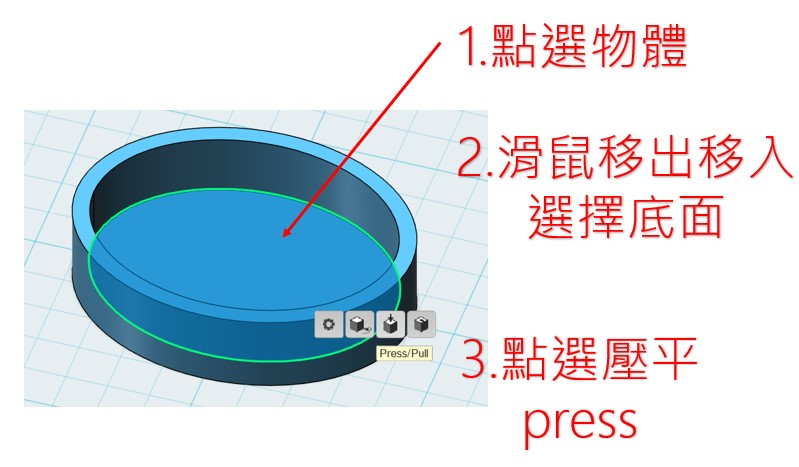
: 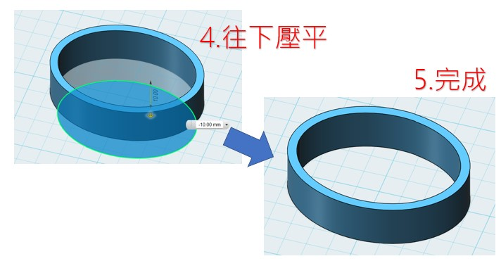

 
 

-------------------------------

### 🔹 星星模具設計

----------------------------

星星造型的建議設計流程如下，你也可以加上自己的創意哦！

: 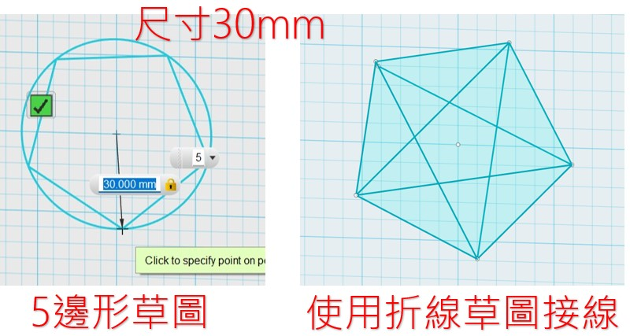

 

: 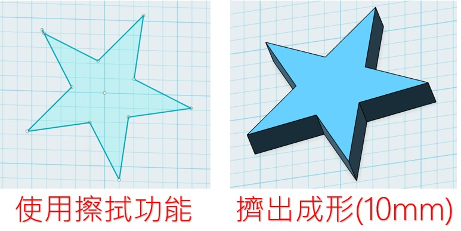

 

: 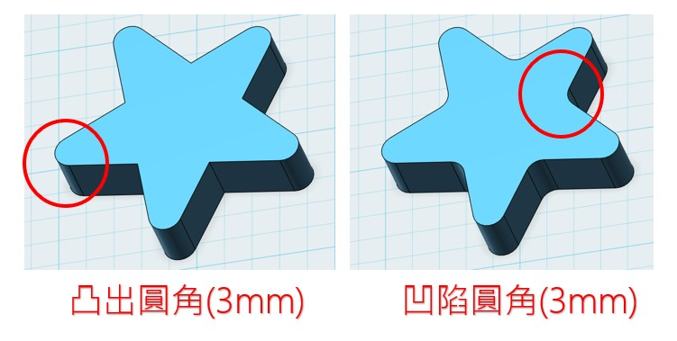

 

: 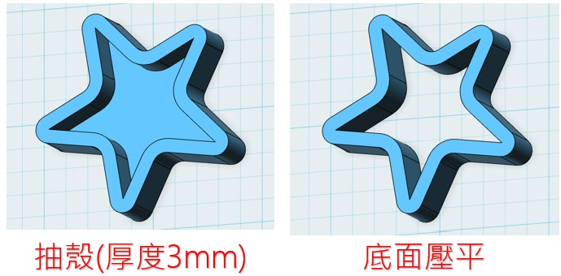

 

 

: :fontawesome-solid-long-arrow-alt-right: <a href="https://youtu.be/ORNPru9gr4U?list=PLlHG10g1RIDLc3SyezU_AR0-iE39ONjui" target="_blank">星星造型設計參考影片</a>

: (影片作者：小白的3DP樂園)

 

 

-------------------------------

### 🔹 兔子造型設計

----------------------------

兔子造型的建議設計流程如下，你也可以加上自己的創意哦！

: 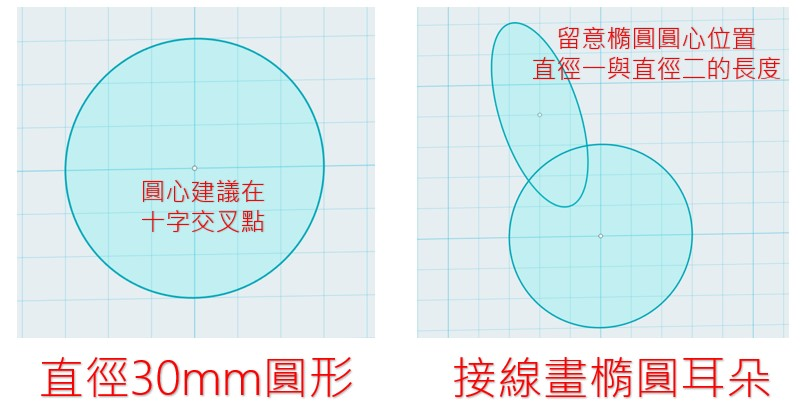

 

: 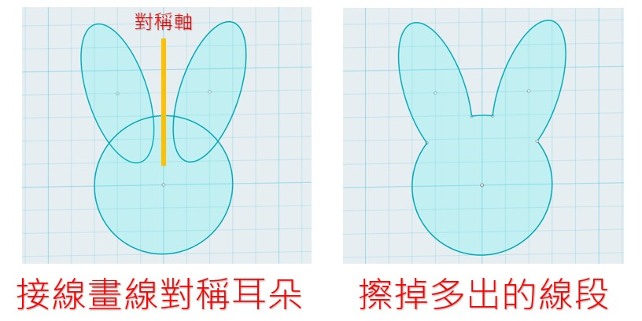

 

: 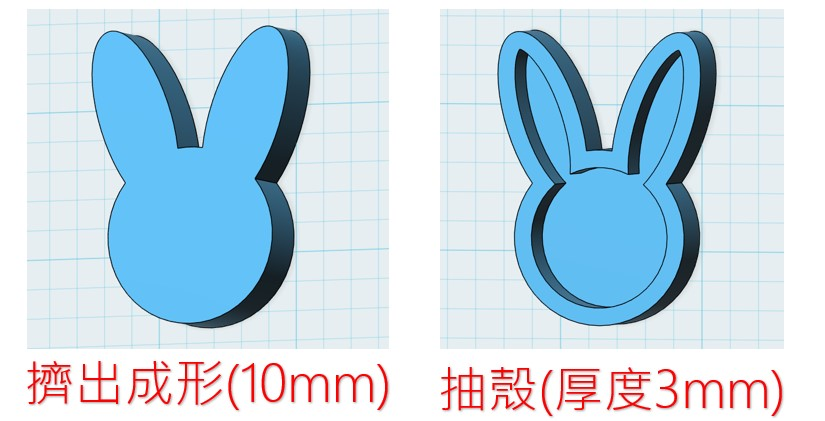

 

: 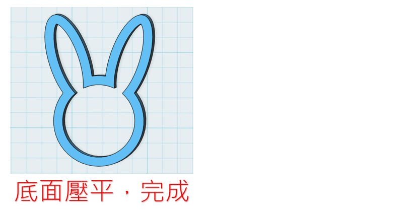

 

 

參考資料：

: :fontawesome-solid-long-arrow-alt-right: <a href="https://youtu.be/X_K_YThyDJw?list=PLlHG10g1RIDLc3SyezU_AR0-iE39ONjui" target="_blank">兔子造型設計影片</a>

: (影片作者：小白的3DP樂園)

 

 

-------------------------------

### 🔹 造型模具的其他用途

----------------------------

: 造型模具除了切出麵團的形狀，來製作餅干，也可以有其他用途。

: 麵團是可以塑形的，想一想，生活中還有什麼類似的東西。

 
 

<iframe width="560" height="315" src="https://www.youtube.com/embed/y4r3W1gIuLk?start=37&amp;end=167" frameborder="0" allow="accelerometer; autoplay; encrypted-media; gyroscope; picture-in-picture" allowfullscreen></iframe>

: ( 資料來源:[^rabbit_clay])

[^rabbit_clay]: 《關媽手作》黏土壓模兔兔教學！by 
陳德慧, youtube網址:https://youtu.be/y4r3W1gIuLk .

 
 

<iframe width="560" height="315" src="https://www.youtube.com/embed/fKvouokxIMY" frameborder="0" allow="accelerometer; autoplay; encrypted-media; gyroscope; picture-in-picture" allowfullscreen></iframe>

: ( 資料來源:[^candle_maker])

[^candle_maker]: 超簡單" 蠟燭翻模 " 順序(by 3D列印模具) by 
小白的3DP樂園, youtube網址:https://youtu.be/fKvouokxIMY?list=PLlHG10g1RIDLc3SyezU_AR0-iE39ONjui .

 

 

-------------------------------

### 🔹 小魚造型設計

----------------------------

小魚造型的建議設計流程如下，你也可以加上自己的創意哦！

: 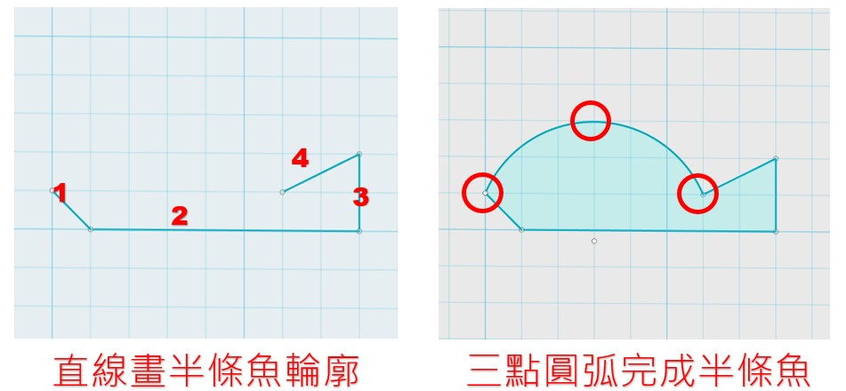

 

: 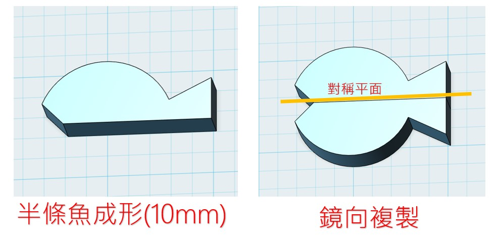

 

: 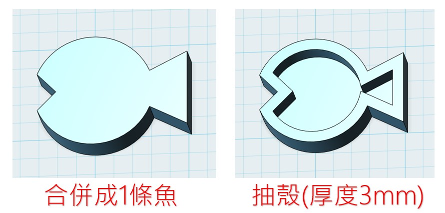

 

: 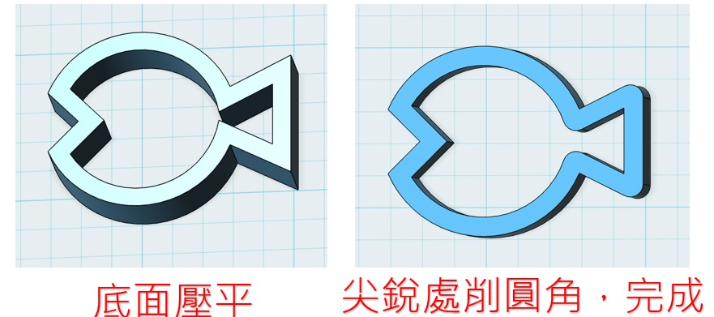

 

 

參考資料：

: :fontawesome-solid-long-arrow-alt-right: <a href="https://www.youtube.com/watch?v=ximZ0n9FBTo&list=PLlHG10g1RIDLc3SyezU_AR0-iE39ONjui&index=15" target="_blank">小魚造型設計影片</a>

: (影片作者：小白的3DP樂園)

 

 

-------------------------------

### 🔹 愛心造型設計

----------------------------

愛心造型的建議設計流程如下，你也可以加上自己的創意哦！

: 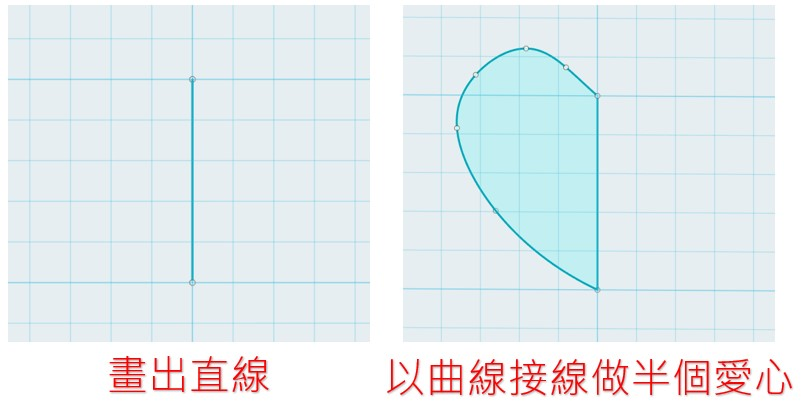

 

: 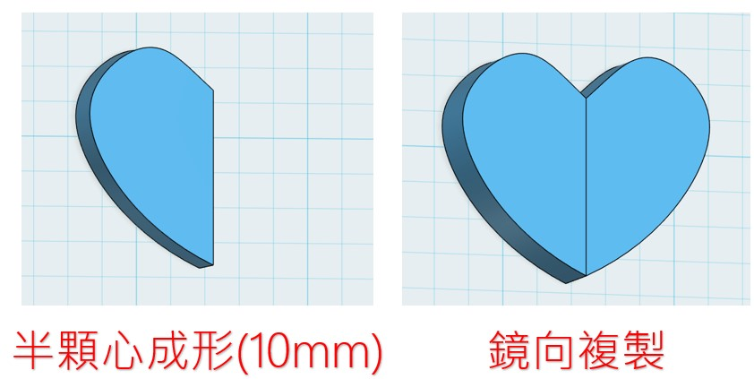

 

: 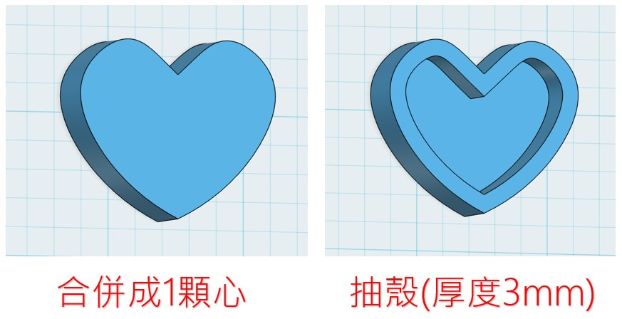

 

: 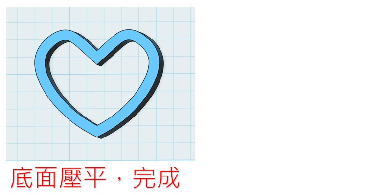

 

 

參考資料：

: :fontawesome-solid-long-arrow-alt-right: <a href="https://youtu.be/n9UDvSWCZJk?list=PLlHG10g1RIDLc3SyezU_AR0-iE39ONjui" target="_blank">愛心造型設計影片</a>

: (影片作者：小白的3DP樂園)

 

 

-------------------------------

### 🔹 小花造型設計

----------------------------

小花造型的建議設計流程如下，你也可以加上自己的創意哦！

: 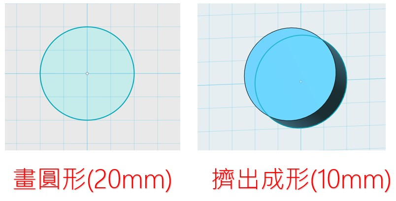

 

: 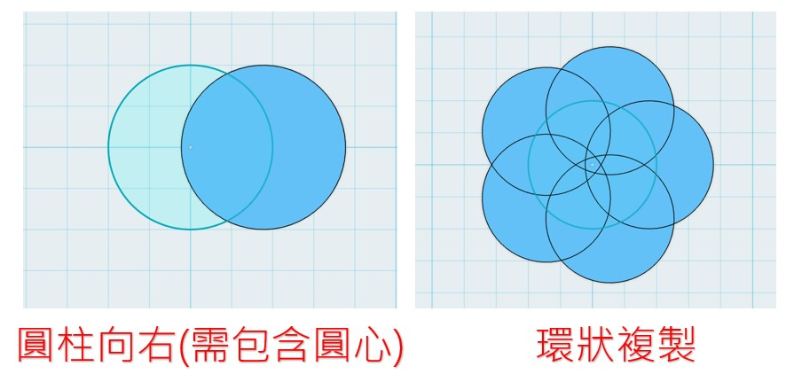

 

: 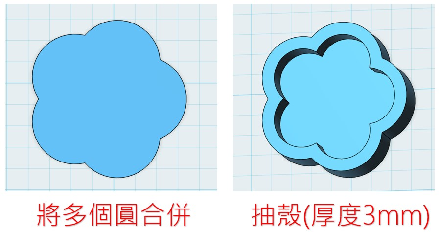

 

: 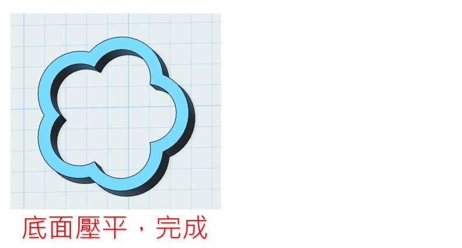

 

 

參考資料：

: :fontawesome-solid-long-arrow-alt-right: <a href="https://youtu.be/wJA-dzUZM_0?list=PLlHG10g1RIDLc3SyezU_AR0-iE39ONjui" target="_blank">小花造型設計影片</a>

: (影片作者：小白的3DP樂園)

 

 
