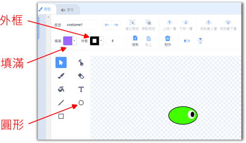
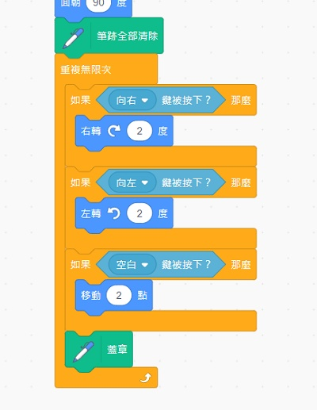
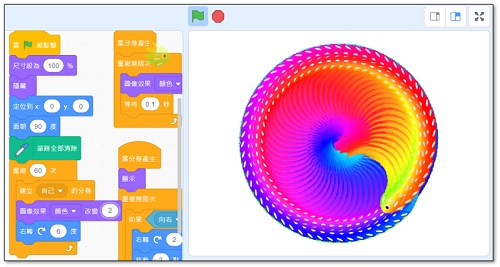

---
hide:
  - navigation
---

# ❤️ Scratch程式 - 彩色萬花筒

-------------------------------

### 🔹 什麼是萬花筒 

----------------------------

萬花筒是一種光學玩具，將有鮮豔顏色的實物放於圓筒的一端，圓筒中間放置三稜鏡，另一端用開孔的玻璃密封，由孔中看去即可觀測到對稱的圖像。1817年蘇格蘭科學家和發明家大衛·布魯斯特爵士發明萬花筒。

: (資料來源:[^what_is_kaleidoscope])

[^what_is_kaleidoscope]: 萬花筒, [維基百科連結](https://zh.wikipedia.org/zh-tw/%E8%90%AC%E8%8A%B1%E7%AD%92)

<iframe width="560" height="315" src="https://www.youtube.com/embed/27Cu1MOQC0Q" frameborder="0" allow="accelerometer; autoplay; encrypted-media; gyroscope; picture-in-picture" allowfullscreen></iframe>

: ( 資料來源:[^kaleidoscope_diy])

[^kaleidoscope_diy]:原來製作萬花筒那麼簡單，而且超美麗的, by 愛媽&愛醬DIY,Craft,Drawing,Story, [youtube連結](https://youtu.be/27Cu1MOQC0Q  ) 

 

本單元會使用Scratch來設計出像萬花筒般美麗，而且可以互動操作的程式！

 
 

-------------------------------

### 🔸 Scratch3存檔操作

----------------------------

Scratch3離線版的存檔與2.0版略有不同，操作如下

: 

 
 

-------------------------------

### 🔸 簡易小精靈

----------------------------

首先，先設計簡易的主角造型(後有進階造型探討，此動作勿花太多時間)。

利用造型工具中的圓形(或方形)設計出小精靈，同時搭配填滿與邊框工具，在小精靈的右方設計出眼睛。(右方為預設方向)。

: 

   

-------------------------------

### 🔸 走路基本程式 

----------------------------

程式需要一個起點，程式也需要不斷重複執行，Scratch常見的基本積木如下：

: 

 

想一想，要如何控制主角，讓主角能走路呢？

 

: 

(若使用不同的按鍵設計也可以，後面的程式需做對應的修改)

 
 

在重複迴圈內，加入按鍵的判斷，就可以做出向左或向右的轉動。

: 

 
 

再加上向前，這樣小精靈就可以動起來了。

: 

   

-------------------------------

### 📌 範例程式1  

----------------------------

:fontawesome-solid-long-arrow-alt-right: <a href="https://scratch.mit.edu/projects/740136407/editor/" target="_blank">「萬花筒01-小精靈走路」</a>

: 

 

   

-------------------------------

### 🔸 造型蓋章  

----------------------------

為了讓小精靈有變化，先開啟「畫筆」的功能，操作如下：

: 

  

程式裡會使用到「蓋章」與「清除」，分別測試積木的功能後。發現「蓋章」可以把小精靈的造型蓋在背景上，而「清除」會把所有蓋出來的造型清掉。

: 

 

想一想，上面這兩個積木，要放在程式的哪裡，才能達到有變化，並且每次執行都能從空白背景開始的效果呢？(重複畫)

   

-------------------------------

### 🔸 漸層與塑形  

----------------------------

漸層色指的是由一種顏色，慢慢改變成另一種顏色。

在Scratch的造型中，與漸層色相關的控制如下說明：

 

: 

除了範例中的綠黃漸層，你也可以試試不同顏色的漸層色，或是不同方向的漸層色。

 
 
 

Scratch造形中的圖片，可以分成點陣圖或是向量圖。在向量圖中，利用節點與彎曲控制，可以改變形狀。

: 

 

你可以試試看，不同的漸層色組合，不同的形狀組合時，小精靈走出來的圖形會有什麼變化。

   

-------------------------------

### 📌 範例程式2  

----------------------------

:fontawesome-solid-long-arrow-alt-right: <a href="https://scratch.mit.edu/projects/740136866/editor/" target="_blank">「萬花筒02-造型與蓋章」</a>

: 

   

-------------------------------

### 🔸 漸變特效  

----------------------------

做出另外一組基本積木，讓顏色的效果每0.1秒改變一次，試試看程式的效果。

: 

 

在上面的積木中，哪一個數字會影響到顏色變化的快慢呢？

   

-------------------------------

### 🔸 多角色  

----------------------------

完成一隻小精靈的設定後，還可再做什麼擴充呢？如果有多隻小精靈同時走路，應該會很有趣吧。

首先在角色的重複迴圈之前，先加入初始設定的積木，如下圖紅框處。

: 

 

接下來，把小精靈的角色複製成4隻，每一隻有不同的面朝角度。

: 

實際操作起來，小精靈的畫是不是更豐富了呢？

但是，想想看，使用4個角色後，有沒有帶來什麼不方便呢？(比如需要修改角色造型時)

   

-------------------------------

### 📌 範例程式3  

----------------------------

:fontawesome-solid-long-arrow-alt-right: <a href="https://scratch.mit.edu/projects/740137408/editor/" target="_blank">「萬花筒03-漸變與多角色」</a>

: 

   

-------------------------------

### 🔸 角色慢速  

----------------------------

如果有更多隻小精靈就會有更美麗的效果，但是當很多隻要調整程式或造型時，操作的步驟變更多，成了一個令人頭痛的問題。所以我們要使用不同的方式。

先將4隻小精靈刪除到原來的1隻(注意勿全部刪除)

: 

 

要跳得高，就要先蹲得低。當我們要產生到30隻以上的小精靈，要先把小精靈的移動及轉動速度變得很慢很慢。

: 

 

當小精靈變得很慢很慢時，畫出來的感覺有沒有不同呢？

   

-------------------------------

### 🔸 分身控制  

----------------------------

Scratch裡有分身的程式，但是要小心使用，不然沒有節制的話，會讓程式變得非常緩慢哦！

分身控制的積木如下，可以用「青蛙下蛋」來理解分身的運行原理：

: 

 

如上例，當一次產生60隻小精靈時，畫起來是不是很像萬花筒的效果呢？

成功的使用分身後，要修改小精靈的程式、顏色及造型就很輕鬆了(只需改一次)，請調整你的小精靈，直到畫出更漂亮的效果。

   

-------------------------------

### 📌 範例程式4  

----------------------------

:fontawesome-solid-long-arrow-alt-right: <a href="https://scratch.mit.edu/projects/740137703/editor/" target="_blank">「萬花筒04-分身控制」</a>

: 

   
