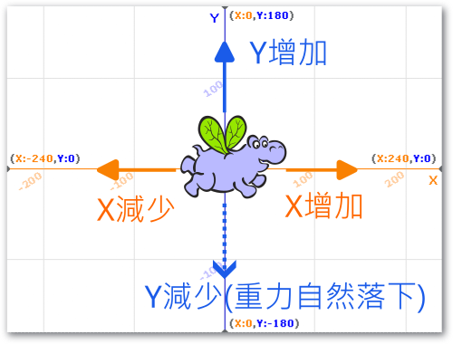
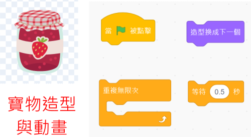
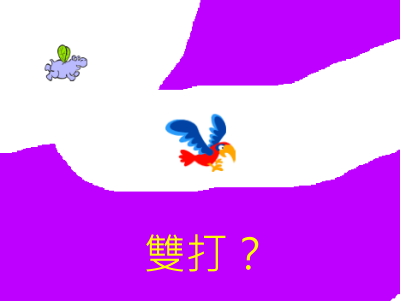

---
hide:
  - navigation
---

# ❤️ Scratch程式 - 迷宮探險

-------------------------------

## 🔹 迷宮探險的構想

----------------------------

: 這次我們要來做出一個迷宮探險的遊戲，一個遊戲有許多的要素。請同學想一想自己的遊戲經驗，我們在製作迷宮探險遊戲時，有哪些細節要先想構想清楚呢？

: 

 

: 關於迷宮的設計，也許可以從下面影片中介紹的繪本來得到靈感：

: <iframe width="560" height="315" src="https://www.youtube.com/embed/OEj6_CiY7c8?start=8&amp;end=93" frameborder="0" allow="accelerometer; autoplay; encrypted-media; gyroscope; picture-in-picture" allowfullscreen></iframe>

: ( 資料來源:[^underground_animal])

[^underground_animal]:地底下的動物（散頁版）, by 豆豆虎, [youtube連結](https://www.youtube.com/watch?v=OEj6_CiY7c8) 

 

: 哇！原來地底下的洞穴有許多的動物居住，洞穴之間也形成不同的地道，從這個想法開始，也許可以做出一個有趣的迷宮探險遊戲呢！

 
 

-------------------------------

## 🔸 角色動作

----------------------------

: 首先，請先決定你的主角，在迷宮中會以飛行的方式來移動。

: 

  

: 在迷宮中，主角會随著重力自然掉落，如果不想墜落地面，可以做出「往上飛」的動作。另外，主角也可以向左或向右飛。

: 

  

: 我們會使用以下的按鍵設計來控制主角。

: 

 
 

-------------------------------

### 📌 範例程式1  

----------------------------

:fontawesome-solid-long-arrow-alt-right: <a href="https://scratch.mit.edu/projects/779506443/" target="_blank">「迷宮探險01_角色動作」</a>

: 

   

-------------------------------

## 🔸 迷宮設計

----------------------------

: 接下來進行迷宮的設計，先將背景轉為點陣圖。

: 

  

: 選定一個危險顏色(你不喜歡的顏色)，利用倒油漆功能填滿背景。危險顏色會在後面的程式中來使用。

: 

  

: 利用橡皮擦來擦出迷宮。

: 

  

: 若想要有背景的迷宮，可參考下圖做法(但步驟較多)。

: 

 

 

-------------------------------

### 📌 範例程式2  

----------------------------

:fontawesome-solid-long-arrow-alt-right: <a href="https://scratch.mit.edu/projects/779506831/" target="_blank">「迷宮探險02_迷宮設計」</a>

: 

   

-------------------------------

## 🔸 角色調整與背景音樂

----------------------------

: 接下來，讓主角放入地圖中。想一想要讓主角從起點出發，需要做什麼設計呢？

: 

  

: 操作主角，試著在地道中飛行看看，想一想，要在危險的地形中安全飛過，要做什麼調整呢？

: 

  

: 如果有個背景音樂，會讓遊戲的感覺更好，要如何設計呢？

: 

 
 

-------------------------------

### 📌 範例程式3  

----------------------------

:fontawesome-solid-long-arrow-alt-right: <a href="https://scratch.mit.edu/projects/779507245/" target="_blank">「迷宮探險03_角色調整」</a>

: 

   

-------------------------------

## 🔸 危險地形

----------------------------

: 在設計危險地形的判斷程式之前，為避色程式變得太複雜，可以使用函式積木來簡化主程式。

: 經由函式積木，我們可以產生一個全新的積木，讓我們把原本主角的操作程式，放到函式積木的定義中。

: 

 
 

: 有了函式積木，主流程就會簡化了。

: 接著，在主流程中加入危險地形的判斷。

: 

 
 

: 當主角碰到危險地形時，會發生什麼事呢？想想看，失敗函式中需要處理哪些事？

: 

 
 

-------------------------------

### 📌 範例程式4  

----------------------------

:fontawesome-solid-long-arrow-alt-right: <a href="https://scratch.mit.edu/projects/779507484/" target="_blank">「迷宮探險04_危險地形」</a>

: 

   

-------------------------------

## 🔸 紀錄挑戰

----------------------------

如果遊戲每次失敗，都要按綠旗重新執行，久了好像有點麻煩，要怎麼改善呢？

當失敗後，馬上可以重新挑戰，就可以避免這個問題，這樣要如何設計呢？

: 

 
 

在嘗試多次後過關，怎樣算比較順利，比較厲害。我們可以利用變數，把挑戰的次數紀錄下來，次數越少表示玩得越厲害。另外，在每次重玩時，可以加個音效，表示新的開始。

: 

 
 

-------------------------------

### 📌 範例程式5  

----------------------------

:fontawesome-solid-long-arrow-alt-right: <a href="https://scratch.mit.edu/projects/779507750/" target="_blank">「迷宮探險05_紀錄挑戰」</a>

: 

   

-------------------------------

## 🔸 挑戰成功

----------------------------

: 先找一個寶物的造型，並設計動畫，當主角碰到寶物時，就算是挑戰成功了。

: 

   

: 當遊戲挑戰成功時，想一想，程式需要做什麼事嗎？

: 

   

: 別忘了，在主程式中，需要加入成功條件的判斷。

: 

   

-------------------------------

### 📌 範例程式6  

----------------------------

:fontawesome-solid-long-arrow-alt-right: <a href="https://scratch.mit.edu/projects/779507918/" target="_blank">「迷宮探險06_挑戰成功」</a>

: 

   

-------------------------------

## 🔸 遊戲延伸設計

----------------------------

: 除了原有的遊戲功能外，還可以增加什麼功能呢？以下提供2個想法，同學們也可以發想不同的功能哦！

: 延伸設計一：紀錄失敗位置，讓使用者在操作時，會特別留意曾經失敗的地形。可以使用畫筆的功能。

: 

   

: 延伸設計二：雙打，讓2位使用者可以闖關，兩個人的話，按鍵位置要如何設計呢？

: 

   

   