---
hide:
  - navigation
---

# ❤️ Scratch程式 - 體感拼字

-------------------------------

## 🔸 體感遊戲與設計構想

----------------------------

: Eye Toy是在2003年推出，索尼PlayStation 2電子遊戲機的一款官方附件，以計算機視覺和手勢識別技術來處理攝影機擷取的影像，可用來偵測動作。

: 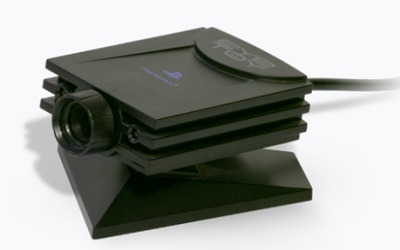

: ( 資料來源:[^eye_toy])

[^eye_toy]:EyeToy, by WolfHugo, [維基百科連結](https://zh.wikipedia.org/zh-tw/EyeToy)

 

 

: 下面的足球遊戲是Eye Toy的一種應用。

<iframe width="560" height="315" src="https://www.youtube.com/embed/tOXzvaiC0w8?start=0&amp;end=60" frameborder="0" allow="accelerometer; autoplay; encrypted-media; gyroscope; picture-in-picture" allowfullscreen></iframe>

: ( 資料來源:[^eye_toy_keeps_up])

[^eye_toy_keeps_up]:Let's Play EyeToy Play - Keep Ups, by WolfHugo, [youtube連結](https://youtu.be/tOXzvaiC0w8) 

 
 

: 下面的功夫遊戲則是Eye Toy的另一種應用。

<iframe width="560" height="315" src="https://www.youtube.com/embed/0h1EKk6JpK8?start=20&amp;end=70" frameborder="0" allow="accelerometer; autoplay; encrypted-media; gyroscope; picture-in-picture" allowfullscreen></iframe>

: ( 資料來源:[^eye_toy_kung_foo])

[^eye_toy_kung_foo]:Let's Play EyeToy Play - Kung Foo (1), by WolfHugo, [youtube連結](https://youtu.be/0h1EKk6JpK8)

 
 

: 在這個單元中，我們會應用Scratch的視訊擴充功能，來做出一個體感拼字的遊戲。

: 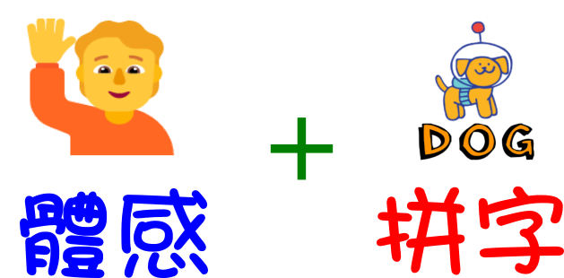

 

 

 

-------------------------------

## 🔹 拼字主角與題目

----------------------------

: 首先，要先決定拼字的主角與題目，請從Scratch挑選一個喜歡的角色，建議挑選的主角單字在3~5個字母之間，以免難度過高。

: 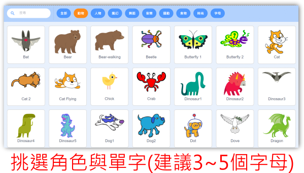

 
 

: 在許多遊戲中，向玩家告知遊戲的目的很重要，所以我們先來設計題目的敘述，如「請拼出DOG」，為了加強效果，我們會使用「逐字說出」，如下圖，想一想，在Scratch中要如何做出這個效果呢？

: 

 

: 請利用以下的積木做出「逐字說出」，如果加上音效會更好哦。

: 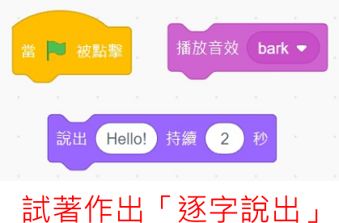

 
 

: 為了讓畫面更活潑，可以切換主角的造型，請用下方的積木做做看。

: 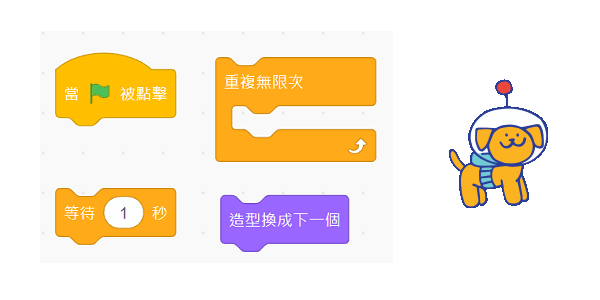

 
 
 

-------------------------------

### 📌 範例程式1  

----------------------------

:fontawesome-solid-long-arrow-alt-right: <a href="https://scratch.mit.edu/projects/845201968/" target="_blank">「體感拼字01_拼字題目」</a>

: 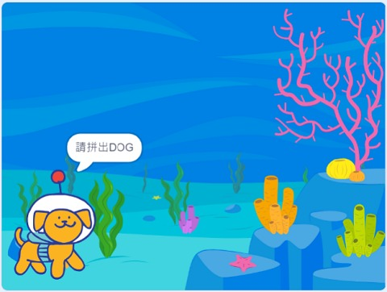

   

-------------------------------

## 🔸 視訊攝影機

----------------------------

: Scratch的攝影機功能，要從Scratch左下方的擴展功能裡面，找到視訊偵測。

: 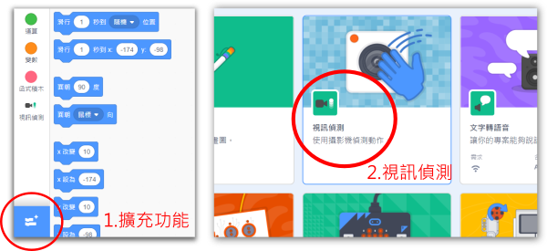

 

: 將視訊開啟後，可以得到鏡像的影像。也可以使用積木，將視訊翻轉。

: 想一想，以下兩種影像，有什麼不同的特性呢？

: 

: 現代的智慧型手機，都會配有兩個鏡頭，這兩個鏡頭在什麼時候會用到呢？

: 

 
 

: 我們也可以利用積木來改變視訊影像的透明度，以下是不同透明度的效果。當攝影機影像越透明，原來的背景就會更清楚。

: 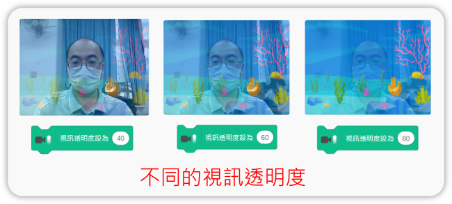

 
 

-------------------------------

### 📌 範例程式2  

----------------------------

:fontawesome-solid-long-arrow-alt-right: <a href="https://scratch.mit.edu/projects/845202404/" target="_blank">「體感拼字02_攝影機」</a>

: 

   

-------------------------------

## 🔹 體感偵測與字母互動

----------------------------

: 當積木的程式由上而下接起來時，程式是循序執行的。

: 但是如果有多個角色時，程式的順序會如何呢？Scratch提供了「廣播通訊」，讓不同角色的程式可以連結起來，通訊的對象可以是一對一、一對多、自己對自己。

: 在本遊戲中，按下綠旗開始後，會先執行「拼字題目」階段，經由廣播進入「遊戲開始」階段。

: 

 
 

: 利用視訊動作值，我們可以知道是否有體感動作發生。

: 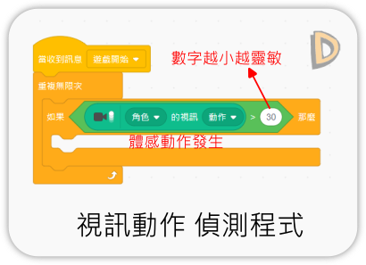

 
 

: 當體感動作發生時，讓字母產生變化，就會有虛實互動的感覺。如果再加上不同的顏色、大小、音效變化效果，互動性會更加提高。

: 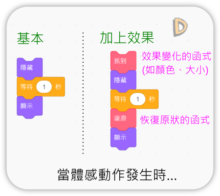

 
 

: 字母一直在原地不動，會沒有挑戰性。想一想，如何利用以下的積木讓字母動起來呢？

: 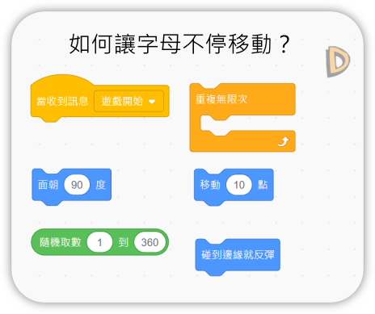

: 可以試著複製出題目中所有的字母。

 
 
-------------------------------

### 📌 範例程式3  

----------------------------

:fontawesome-solid-long-arrow-alt-right: <a href="https://scratch.mit.edu/projects/845202785/" target="_blank">「體感拼字03_體感抓字母」</a>

: 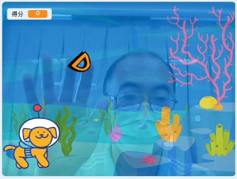

   

-------------------------------

## 🔸 拼字的處理

----------------------------

 
 

-------------------------------

### 📌 範例程式4  

----------------------------

:fontawesome-solid-long-arrow-alt-right: <a href="https://scratch.mit.edu/projects/845203018/" target="_blank">「體感拼字04_拼字處理」</a>

: 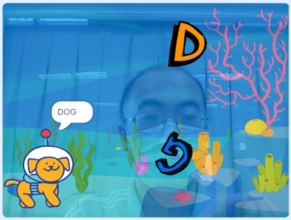

   

-------------------------------

## 🔹 問題解決與完善遊戲

----------------------------

 
 

### 📌 範例程式5  

----------------------------

:fontawesome-solid-long-arrow-alt-right: <a href="https://scratch.mit.edu/projects/845203196/" target="_blank">「體感拼字05_完成遊戲」</a>

: 

   