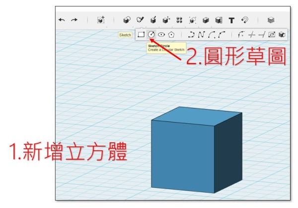
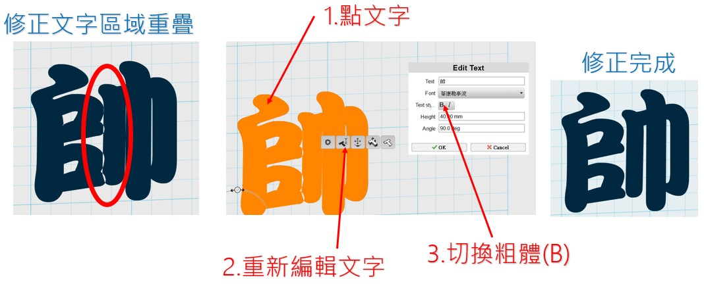
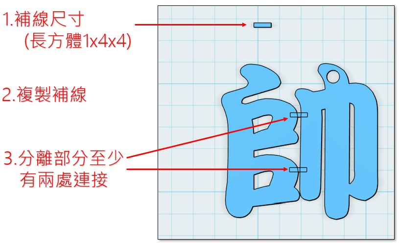

---
hide:
  - navigation
---

# ❤️ 3D - 姓名鑰匙圈

-------------------------------

### 🔹 **中文姓名鑰匙圈** 

----------------------------

: 在書局或紀念品商店，常常可以看到姓名鑰匙圈，如果能有一個與自己名字相關的鑰匙圈裝飾，一定很特別。

: 以下是學生的姓名鑰匙圈設計作品：

: <iframe width="560" height="315" src="https://www.youtube.com/embed/7DDGD-OoAzA?start=368&amp;end=444" frameborder="0" allow="accelerometer; autoplay; encrypted-media; gyroscope; picture-in-picture" allowfullscreen></iframe>

 

: 接下來，我們會以「**一個中文字**」的姓名為主題，來設計鑰匙圈的裝飾。

   

-------------------------------
 

### 🔸 **打洞練習**

----------------------------

: 鑰匙圈裝飾為了固定的功能，需要在上面打出一個洞。

: 打洞的操作與一個哆啦A夢的道具很像。在漫畫人物哆啦A夢的百寶袋中，有一個神奇的道具是「超空間割刀」。

: 它可以在任何地方做出超空間櫥櫃，用來儲存物品，當作保險箱用。又名「儲物箱刀片」。

: 

: (資料來源:[^doraemon_locker_cutter])

[^doraemon_locker_cutter]: 左圖來源 由 ©藤子プロ・小學館・テレビ朝日・シンエイ・ADK - https://www.shogakukan.co.jp/pr/tencomi/doraemon/, 合理使用, https://zh.wikipedia.org/w/index.php?curid=8075604 ； 右圖來源 哆啦A夢中文網 https://chinesedora.com/database/tag/%E8%B6%85%E7%A9%BA%E9%96%93%E5%89%B2%E5%88%80

: 接下來，我們先來練習在3D物件上打洞。

  

: 這邊的操作動作很多，同學們要仔細聽講，並認真練習。我們會先在平面上畫出圓形草圖。

: 一開始，先找到圓形草圖的功能。

: 

  

:  接下來，畫出圓形草圖的形狀。

: 

  

: 再來，找到擠出Extrude的功能(齒輪選單)

: 

  

: 最後滑鼠拖曳拉出，完成打洞的練習。(可以多打幾個洞)

: 

   

-------------------------------
 

### 🔹 **文字草圖**

----------------------------

: 接下來，開始正式的姓名鑰匙圈設計。

: 中文姓名鑰匙圈建議以「1個中文字」為佳，要選擇哪一個字呢？

: 姓名鑰匙圈是要給我自己？還是要送給家人呢？

: 姓名鑰匙圈可以用在什麼地方？

: 

  

: 電腦中的文字有不同的字型，有的字型粗，有的字型細，各有不同的風格。

: 

  

: 決定內容與字型之後，接下來要準備文字草圖。

: 

  

: 設定文字的草圖內容，填入「文字內容」、擇擇「字型」，字型大小填「40」mm。

: 

  

: 完成後的文字草圖設計如下，請做出你自己的設計：

: 

  

注意！若有發生以下筆劃重疊的情形，請重新編輯文字並切換取消粗體。

: 

   

-------------------------------
 

### 🔸 **擠出成形**

----------------------------

有了草圖，就可以擠出成形了。

123D Design對於中文字型，常會無法擠出。所以在確認文字無認後，要做出分解的動作。分解後，文字就無法重新編輯。未連接的文字及部首，則會被分解開來。

: 

  

擠出時，物件擠出的高度是4mm。

: 

  

擠出的文字物件，因底下草圖透視的關係，會不容易看清楚，所以要做隱藏草圖的動作。

: 

   

-------------------------------
 

### 🔹 **打洞設計**

----------------------------

因為鑰匙圈的裝飾，會以鐵環或珠鏈穿過，所以接下來要來打洞，但是洞的位置要打在哪裡呢？

: 

  

鐵環或珠鏈的直徑大約是2.5mm左右，所以洞的直徑3mm就可以了。

: 

   

-------------------------------
 

### 🔸 **鏤空補線**

----------------------------

: 姓名鑰匙圈裝飾是一種鏤空設計。什麼是鏤空呢？

: 

: ( 資料來源:[^hollow_out])

[^hollow_out]:教育部《重編國語辭典修訂本》2021, https://dict.revised.moe.edu.tw

  

: 在藝文課的紙雕勞作中，常常可以看到鏤空的設計。

: 

: ( 資料來源:[^paper_art])

[^paper_art]:國父紀念館-生活美學班-剪綾紙-剪紙-紙雕, https://kiki32303.wordpress.com/2021/02/03/%E5%9C%8B%E7%88%B6%E7%B4%80%E5%BF%B5%E9%A4%A8-%E7%94%9F%E6%B4%BB%E7%BE%8E%E5%AD%B8%E7%8F%AD-%E5%89%AA%E7%B6%BE%E7%B4%99-%E5%89%AA%E7%B4%99-%E7%B4%99%E9%9B%95/

  

: 在街道上的廣告看板，經由鏤空設計，變成美麗的燈箱。

: 

: ( 資料來源:[^hollow_out_product])

[^hollow_out_product]:京鼎設計有限公司 | 專業廣告招牌, http://www.jd-ad.com.tw/index-f1.html

  

: 鏤空的設計可能會發生如下圖的情形，要如何避免呢？

: 

  

: 我們使用細的「補線」，讓鏤空的筆劃不會分開。

: 

   

-------------------------------
 

### 🔹 **姓名鑰匙圈與3D列印**

----------------------------

設計好的姓名鑰匙圈，可以用3D列印的方式做出成品。看看3D列印是如何做出姓名鑰匙圈。

<iframe width="560" height="315" src="https://www.youtube.com/embed/yK8oNDNSlvw?start=173&amp;end=352" frameborder="0" allow="accelerometer; autoplay; encrypted-media; gyroscope; picture-in-picture" allowfullscreen></iframe>

   

-------------------------------

### 🔸 **延伸設計 英文姓名鑰匙圈** 

----------------------------

: 如果要設計英文的姓名鑰匙圈裝飾，要怎麼設計呢？

: 參考下面的幾種形式，說說看，這些設計有什麼不同：

: 

 

: 

 

: 

: ( 資料來源:[^nametag_design])

[^nametag_design]:https://www.etsy.com/uk/market/name_tag

  

: 想一想，依前面學到的經驗，在設計英文姓名鑰匙圈，需要注意什麼？

: * 大小尺寸

: * 字體選擇

: * 穿洞設計

: * 有無需要連接

: 動手做做看，設計出獨一無二的英文姓名鑰匙圈。

   