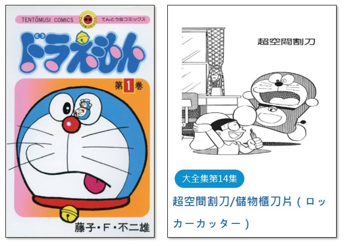

---
hide:
  - navigation
---

# ❤️ 3D - 姓名鑰匙圈

-------------------------------

## 🔹 姓名鑰匙圈 - 中文 

----------------------------

: 在書局或紀念品商店，常常可以看到姓名鑰匙圈，如果能有一個與自己名字相關的鑰匙圈裝飾，一定很特別。

: 以下是學生的姓名鑰匙圈設計作品：

<iframe width="560" height="315" src="https://www.youtube.com/embed/7DDGD-OoAzA?start=368&amp;end=444" frameborder="0" allow="accelerometer; autoplay; encrypted-media; gyroscope; picture-in-picture" allowfullscreen></iframe>

 

: 接下來，我們會以「**一個中文字**」的姓名為主題，來設計鑰匙圈的裝飾。

   

-------------------------------
 

### **打洞練習**

----------------------------

: 鑰匙圈裝飾為了固定的功能，需要在上面打出一個洞。

: 打洞的操作與一個哆啦A夢的道具很像。在漫畫人物哆啦A夢的百寶袋中，有一個神奇的道具是「超空間割刀」。

: 它可以在任何地方做出超空間櫥櫃，用來儲存物品，當作保險箱用。又名「儲物箱刀片」。

: 

: (資料來源:[^doraemon_locker_cutter])

[^doraemon_locker_cutter]: 左圖來源 由 ©藤子プロ・小學館・テレビ朝日・シンエイ・ADK - https://www.shogakukan.co.jp/pr/tencomi/doraemon/, 合理使用, https://zh.wikipedia.org/w/index.php?curid=8075604 ； 右圖來源 哆啦A夢中文網 https://chinesedora.com/database/tag/%E8%B6%85%E7%A9%BA%E9%96%93%E5%89%B2%E5%88%80

: 接下來，我們先來練習在3D物件上打洞。

  

: 這邊的操作動作很多，同學們要仔細聽講，並認真練習。我們會先在平面上畫出圓形草圖。

: 一開始，先找到圓形草圖的功能。

: 

  

:  接下來，畫出圓形草圖的形狀。

: 

  

: 再來，找到擠出Extrude的功能(齒輪選單)

: 

  

: 最後滑鼠拖曳拉出，完成打洞的練習。(可以多打幾個洞)

: 

   

-------------------------------
 

### **文字草圖**

----------------------------

: 接下來，開始正式的姓名鑰匙圈設計。

: 中文姓名鑰匙圈建議以「1個中文字」為佳，要選擇哪一個字呢？

: 姓名鑰匙圈是要給我自己？還是要送給家人呢？

: 姓名鑰匙圈可以用在什麼地方？

: 

  

: 電腦中的文字有不同的字型，有的字型粗，有的字型細，各有不同的風格。

: 

  

: 決定內容與字型之後，接下來要準備文字草圖。

: 

  

: 設定文字的草圖內容，填入「文字內容」、擇擇「字型」，字型大小填「40」mm。

: 

  

: 完成後的文字草圖設計如下，請做出你自己的設計：

: 

  

注意！若有發生以下筆劃重疊的情形，請重新編輯文字並切換粗體。

: 

   

-------------------------------
 

### **擠出成形**

----------------------------

有了草圖，就可以擠出成形了。

123D Design對於中文字型，常會無法擠出。所以在確認文字無認後，要做出分解的動作。分解後，文字就無法重新編輯。未連接的文字及部首，則會被分解開來。

: 

  

擠出時，物件擠出的高度是4mm。

: 

  

擠出的文字物件，因底下草圖透視的關係，會不容易看清楚，所以要做隱藏草圖的動作。

: 

  

   

-------------------------------
 

### **打洞設計**

----------------------------

建構中…

   

-------------------------------
 

### **鏤空補線**

----------------------------

建構中…

   

