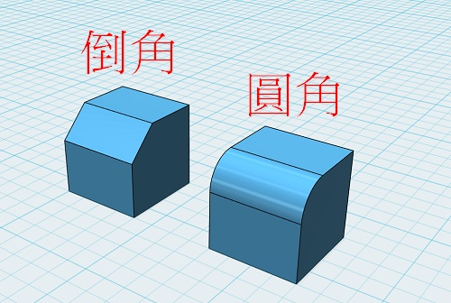

---
hide:
  - navigation
---

# ❤️ 3D - 魔術方塊

-------------------------------

### 🔹 認識魔術方塊 

----------------------------

魯比克·厄爾諾是匈牙利的建築學和雕塑學教授，為了幫助學生們認識空間立方體的組成和結構，所以他自己動手做出了第一個魔術方塊的雛形來，其靈感是來自於多瑙河中的沙礫。

1974年，魯比克教授發明了第一個魔術方塊，1980年Ideal Toys公司於販售此玩具，並將名稱改為Rubik's Cube。

 

: 

: (資料來源:[^rubik_cube])

[^rubik_cube]: 魔術方塊, [維基百科連結](https://zh.m.wikipedia.org/zh-tw/%E9%AD%94%E6%96%B9)

一起來做出魔術方塊的3D模型吧

 
 

-------------------------------

### 🔸 新增立方體 

----------------------------

: 點選primitvie(基本物體)，新增一個立方體

: 

   

-------------------------------

### 🔹 倒角與圓角

----------------------------

: 觀察電腦桌的邊緣及角，摸起來的感覺怎麼樣？會不會讓人割傷？

: 

 

: 如何將砧板的角，削成圓角？

: <iframe width="560" height="315" src="https://www.youtube.com/embed/20jq8PvT-so?start=9&amp;end=163" frameborder="0" allow="accelerometer; autoplay; encrypted-media; gyroscope; picture-in-picture" allowfullscreen></iframe>

: ( 資料來源:[^rounded_corner])

[^rounded_corner]:How to Make Rounded Corners on Cutting Boards, [youtube連結](https://www.youtube.com/watch?v=20jq8PvT-so) 

: 想想看，影片中圓角大小與紅色圓形蓋子的尺寸，與有什麼關係？

 

: 倒角及圓角是使物體的銳利稜角或邊緣，變得和緩的常見加工技術。

: 

 

: 練習將立方體的邊，削圓角或倒角

: 點選立方體，再點選邊，按下齒輪圖示，選圓角或倒角

: 

   

-------------------------------

### 🔸 立方體削圓角

----------------------------

: 立方體有幾個面？幾個邊？

: 將立方體的12個邊都削成圓角(建議圓角半徑2)

: 並決定魔術方塊的底色(常見底色有黑、藍、白)

: 

   

-------------------------------

### 🔹 投影與三視圖

----------------------------

當3D空間的模擬物體，投影至2D畫面時(如觀看者的螢幕)，可以分成透視與正交投影2種方式：

: 

: (資料來源:[^3d_projection])

[^3d_projection]: 3d projection, [維基百科連結](https://en.wikipedia.org/wiki/3D_projection)

 

123D Design的視角改變操作如下

: 

 

在工程製圖中常把物體在某個投影面上的正投影稱為視圖。常見的三視圖為前視圖、俯視圖、側視圖，是一種在平面製圖中，呈現立體物件的方法。

: 

: (資料來源:[^three_view])

[^three_view]: 三視圖, [三視圖說明連結](http://web.nanya.edu.tw/mechanic/e-book/97B-001/HomePage/threeview.htm)

   

-------------------------------

### 🔸 複製魔術方塊

----------------------------

複製與貼上需利用鍵盤熱鍵操作

: 

 

分別使用前視、俯視、側視的視角，再加上複製與貼上的工具，即可準確的完成魔術方塊的基本形狀。

: 

   

-------------------------------

### 🔹 魔術方塊配色 

----------------------------

常見的魔術方塊為3x3x3(長寬高)，官方配色有6色，並有固定排列

: 

: (資料來源:[^rubik_cube])

上圖為魔術方塊6面的展開圖，想一想，共有哪6種顏色？哪些白色的對面是什麼顏色？

 

-------------------------------

### 🔸 紙張的厚度

----------------------------

你知道一張紙對折幾次就能抵達月球？！請看看下面的影片

: <iframe width="560" height="315" src="https://www.youtube.com/embed/_Z0v-FCohOM" frameborder="0" allow="accelerometer; autoplay; encrypted-media; gyroscope; picture-in-picture" allowfullscreen></iframe>

: ( 資料來源:[^fold_paper])

[^fold_paper]:一張紙對折 XX 次就能抵達月球？！, [youtube連結](https://www.youtube.com/watch?v=_Z0v-FCohOM) 

 

看起來薄薄的一張紙，它的厚度是多少mm呢？

: 

: ( 資料來源:[^fold_paper])

  

-------------------------------

### 🔹 貼紙模型的製作

----------------------------

在上面的範例中，原本的方塊尺寸為 20mm x 20mm x 20mm ，削圓角的半徑為2mm，這樣可以知道貼紙的精確尺寸嗎？

 

: 

 

將貼紙產生，並換好顏色後，再利用以下的磁鐵功能，將貼紙貼在方塊上。

: 

 

接下來，請完成魔術方塊的3D模型。

  

-------------------------------

### 🔸 結語

----------------------------

想一想，從魔術方塊製作的過程中，你學到了什麼？你的感想是什麼？

   